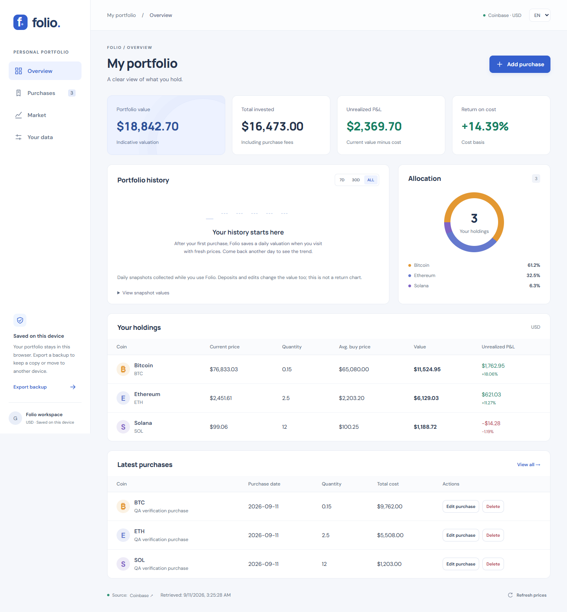

# Folio

A private crypto portfolio tracker for people who want to understand what they
hold, what they paid, and what it is worth now.

[](https://github.com/godaylor/crypto-portfolio/actions/workflows/ci.yml)

**Repository:** https://github.com/godaylor/crypto-portfolio

**Hosted app:** https://folio-crypto-godaylor.maxeemzhuparov.chatgpt.site
(currently owner-only; public access approval pending).



[Mobile RU](docs/screenshots/portfolio-mobile-ru.png) · [Purchase ledger](docs/screenshots/purchases-desktop.png) · [Market](docs/screenshots/market-desktop.png)

## What works

- Record, edit and delete purchase lots with quantity, purchase price, fee,
  date and note. Undo the last deletion.
- Live indicative USD quotes for 12 coins, using Coinbase and automatic Kraken
  fallback. Each view shows the provider and retrieval time. Failed refreshes
  preserve cached quotes with an explicit stale warning.
- Weighted average purchase price, current valuation, unrealized P&L, ROI and
  allocation. Missing quotes never become a fabricated zero valuation.
- Actual daily portfolio observations, with 7-day, 30-day and full-history
  views and an accessible values table. History begins when the portfolio is
  used; no fabricated preloaded performance.
- Browser persistence, cross-tab updates, JSON backup export/import with
  validation and replacement confirmation, and CSV purchase export.
- English/Russian interface, mobile navigation, keyboard-operated dialogs,
  empty/loading/error states and recovery download for corrupt data.

This is a manual holdings tracker, not an exchange. It does not execute trades,
connect wallets, model sales, calculate taxes or offer investment recommendations.

## First use

1. Open Folio and choose **Add purchase**.
2. Select a coin, enter quantity, actual price paid, fee and purchase date.
3. Save to see cost, current value, P&L and allocation.
4. Return to **Purchases** to correct or delete a record.
5. Use **Your data → Export backup** before clearing browser data or changing devices.

New visitors always start with an empty portfolio. Documentation screenshots
use QA purchases and real fetched prices; these purchases are not bundled.

## Architecture and stack

React 18, strict TypeScript 5, Vite 7, ESLint 9/typescript-eslint, React Hooks
lint rules, Node test runner via tsx, and Playwright. Styling is original CSS;
charts use SVG and CSS. Fonts: self-hosted DM Sans and Manrope (OFL).

```text
React UI → validated purchase lots → localStorage (versioned JSON)
         → domain calculations    → holdings / P&L / allocation
         → dated observations    → history chart and table
Public Coinbase API → Kraken fallback → validated quote cache
```

All holdings remain in the browser. There is no backend, account, database or
secret to provision. This is a deliberate architecture for a private manual
tracker; it does not claim cloud sync. The app can be hosted on any static
HTTPS host. A server would be required for future shared accounts, automatic
imports or scheduled observations while the app is closed.

## Calculation details

Cost per purchase is `quantity × unit price + fee`. Purchases are grouped by
coin; weighted average price includes fees. Unrealized P&L is `market value −
cost`; ROI is `P&L / cost × 100`. Zero-cost holdings show no ROI denominator.
Prices are indicative USD quotes, not executable orders. Native JavaScript
floating-point arithmetic is for visualization, not accounting settlement.

Daily snapshots are captured when fresh prices and a non-empty portfolio are
available. Edits update today's observation, not historical observations.
Changes in holdings can change chart value independently of market performance.
No time-weighted or money-weighted return is claimed. Backups include history.

## Local development

Requires Node 22 and npm. No environment variables or service keys are required;
see `.env.example` for the optional E2E target.

```sh
cd frontend
npm ci
npm run dev
```

If another project uses the default port, choose a free port, e.g.
`npm run dev -- --port 5188 --strictPort`. Do not stop another project's process.

```sh
npm run typecheck
npm run lint
npm test
npm run build
npx playwright install chromium
npm run preview -- --port 5188 --strictPort
# In another terminal:
npm run e2e
```

Windows E2E uses installed Google Chrome. Linux CI uses Playwright Chromium.
Browser tests use mocked quotes to verify arithmetic, failure handling and
persistence; production smoke tests use real providers.

## Deployment

`npm run build` emits `dist/` at the repository root. Upload that directory to an HTTPS
static host; relative asset paths support root and subpath hosting. No SPA
rewrite is needed because navigation uses URL fragments.

Sites configuration is in `.openai/hosting.json`. Source credentials must remain
ephemeral and must not be committed. The hosted URL and verification state
are recorded in PORTFOLIO_HANDOFF.md.

CI installs the lockfile, checks types/lint/tests/dependencies, builds, runs
browser scenarios and uploads a deployable artifact. An optional manually
triggered **Deploy Pages** workflow requires Pages configured for GitHub Actions;
it does not run automatically. Sites is a validated manual publish; CI stores
no Sites credentials.

## Data and privacy

Portfolio: `folio.portfolio.v1`; quote cache: `folio.market.v1`; language:
`folio.language`. Data is not encrypted and is accessible to scripts on the
same origin. Clearing site data removes it; backups are essential. Public API
requests carry no holdings. Fonts are served locally; there are no analytics
scripts. Providers can rate-limit or restrict regions; cached/unavailable
states are explicit and never replaced with sample prices.

## Ownership and licensing

Maxeem's contribution is the independent Folio domain model, UI, market adapter,
persistence and backup workflow, localization, tests and deployment work, with
AI assistance. React, tooling and fonts are credited separately.

MIT covers the new implementation only. Historical source rights are not
inferred from Git authorship. Seven preserved historical files are excluded
from production and the new license; see [PROVENANCE.md](PROVENANCE.md) and
[THIRD_PARTY_NOTICES.md](THIRD_PARTY_NOTICES.md).
